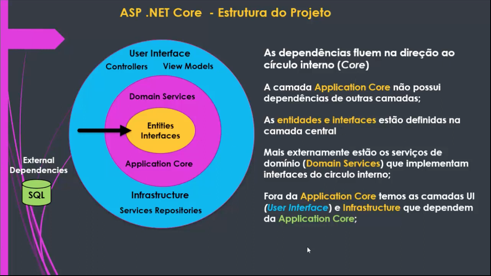
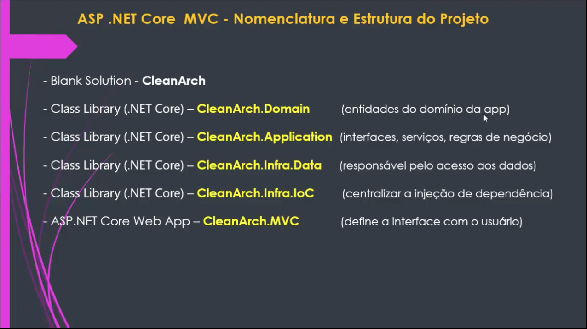
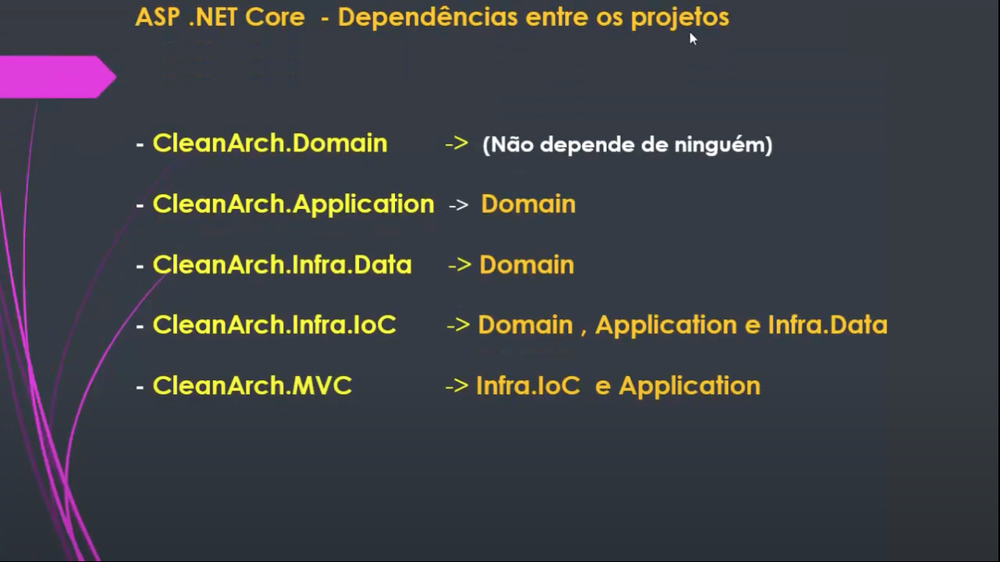
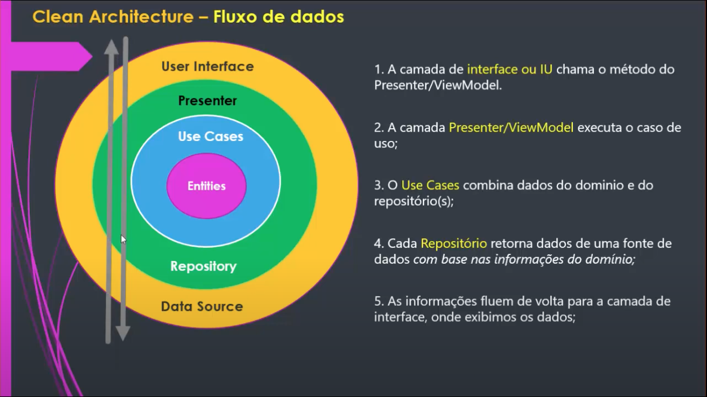
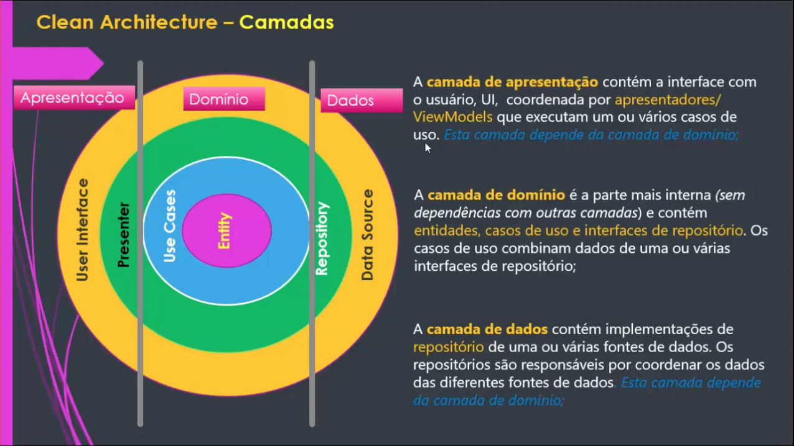
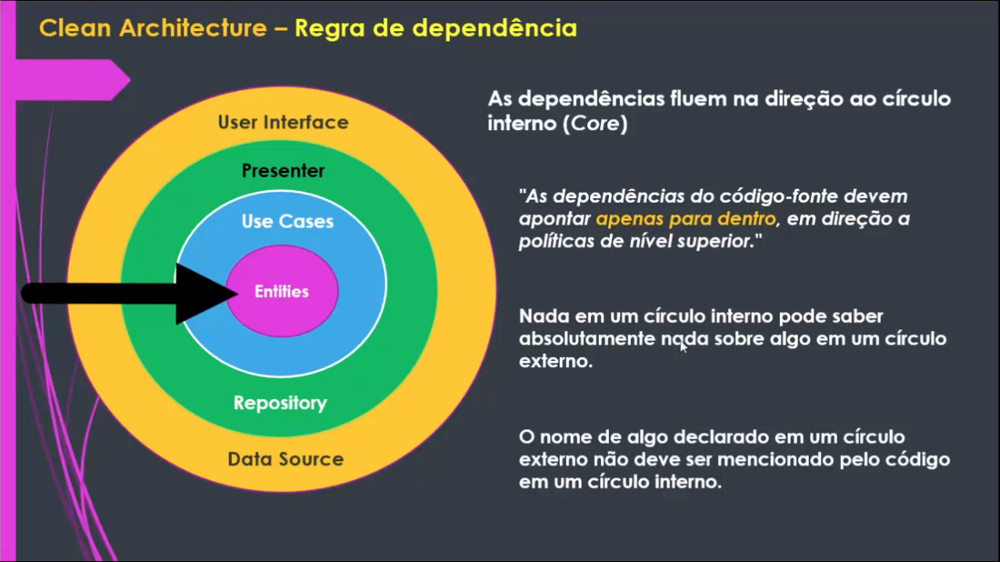
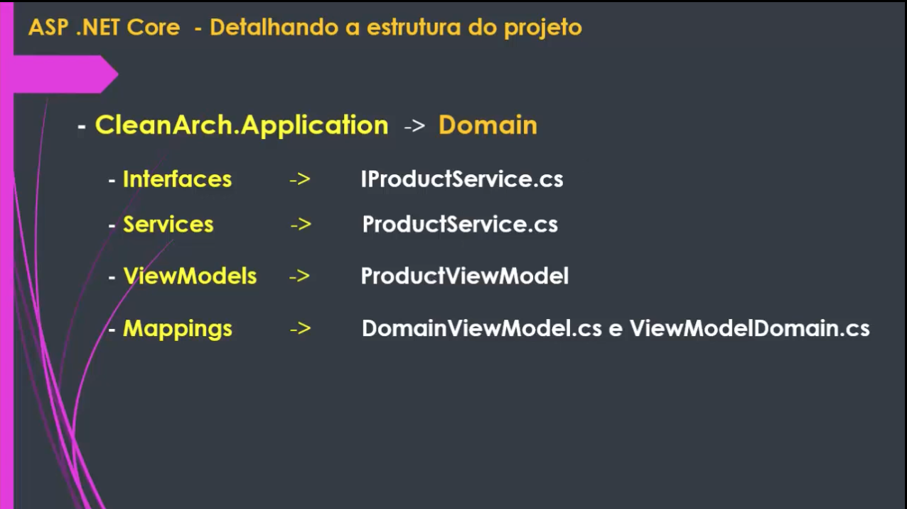
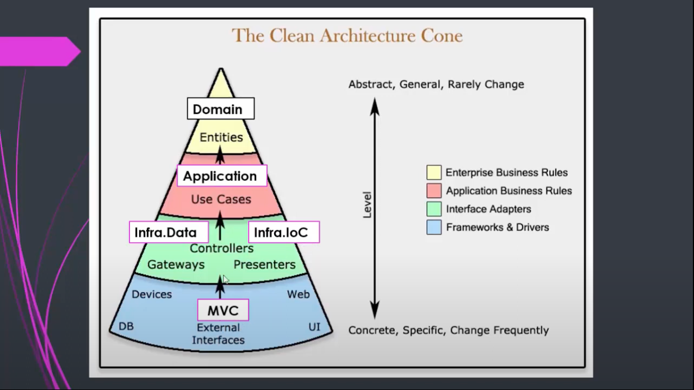

# Clean Architecture using ASP.NET Core

This repo is used for the apprenticeship Clean Architecture.

## **Running this app**

---

```console
foo@bar:~$ ./start.sh
```
**Exposed in:** http://localhost:5261/

&nbsp;











&nbsp;

## **Migrations Manually**

---

1. ```console
       foo@bar:~$ cd app/CleanArch/CleanArch.Infra.Data
   ```

2. ```console
       foo@bar:~$ dotnet ef --startup-project ../CleanArch.MVC/ migrations add Initial
   ```

#### **Update Database**

1. ```console
       foo@bar:~$ cd app/CleanArch/CleanArch.Infra.Data
   ```

2. ```console
       foo@bar:~$ dotnet ef --startup-project ../CleanArch.MVC/ database update
   ```

&nbsp;

## **References:**

---

- .[NET - Apresentando Clean Architecture](https://youtube.com/watch?v=ZWfrI5Bu6so&si=EnSIkaIECMiOmarE)

- [.NET - Implementando a Clean Architecture - I](https://youtube.com/watch?v=PjBJznRvJqc&si=EnSIkaIECMiOmarE)

- [.NET - Implementando a Clean Architecture - II](https://youtube.com/watch?v=Ase1mJADt00&si=EnSIkaIECMiOmarE)

- [.NET - Implementando a Clean Architecture - III](https://youtube.com/watch?v=y5Fhq8qxboo&si=EnSIkaIECMiOmarE)

- [.NET - Implementando a Clean Architecture - IV](https://youtu.be/ZnJvhD_LNsQ)

- [.NET - Implementando a Clean Architecture - V](https://youtube.com/watch?v=IGnE16_j8Ro&si=EnSIkaIECMiOmarE)

- [.NET - Implementando a Clean Architecture - VI](https://youtube.com/watch?v=jJmeVWCDIDk&si=EnSIkaIECMiOmarE)

- [Criando testes unitários em uma aplicação .Net Core já existente](https://youtube.com/watch?v=1-o4nyXsiDc&si=EnSIkaIECMiOmarE)
