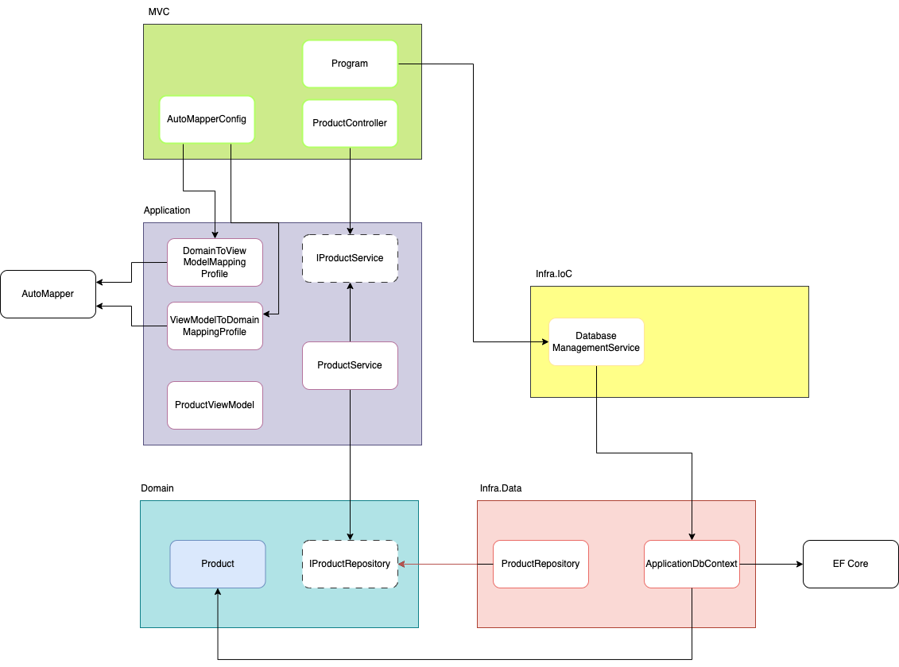

# Clean Architecture using ASP.NET Core

This repo is used for the apprenticeship Clean Architecture.

&nbsp;

## **Migrations**

---

1. cd app/CleanArch/CleanArch.Infra.Data

2. dotnet ef --startup-project ../CleanArch.MVC/ migrations add Initial

#### **Update Database**

1. cd app/CleanArch/CleanArch.Infra.Data

2. dotnet ef --startup-project ../CleanArch.MVC/ database update

&nbsp;

## **References:**

---

- .[NET - Apresentando Clean Architecture](https://youtube.com/watch?v=ZWfrI5Bu6so&si=EnSIkaIECMiOmarE)

- [.NET - Implementando a Clean Architecture - I](https://youtube.com/watch?v=PjBJznRvJqc&si=EnSIkaIECMiOmarE)

- [.NET - Implementando a Clean Architecture - II](https://youtube.com/watch?v=Ase1mJADt00&si=EnSIkaIECMiOmarE)

- [.NET - Implementando a Clean Architecture - III](https://youtube.com/watch?v=y5Fhq8qxboo&si=EnSIkaIECMiOmarE)

- [.NET - Implementando a Clean Architecture - IV](https://youtu.be/ZnJvhD_LNsQ)

- [.NET - Implementando a Clean Architecture - V](https://youtube.com/watch?v=IGnE16_j8Ro&si=EnSIkaIECMiOmarE)

- [.NET - Implementando a Clean Architecture - VI](https://youtube.com/watch?v=jJmeVWCDIDk&si=EnSIkaIECMiOmarE)
